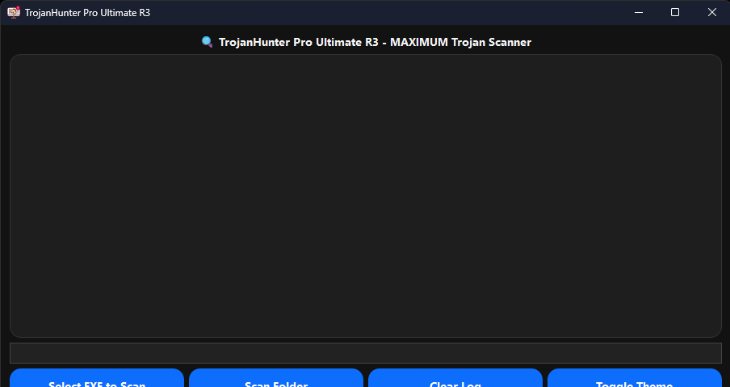

# TrojanHunter Pro Ultimate R3  
🚀 **50th Project Milestone**  

**TrojanHunter Pro Ultimate R3** is an advanced PyQt6 malware scanner designed to detect suspicious patterns in `.exe` files. Using regex-based scanning, SHA256 caching, and risk classification, it helps identify potentially malicious executables with speed and style.  

---

## ✨ Features  
- **Regex-based malware detection** for a wide range of suspicious patterns (API calls, networking, persistence, etc.)  
- **SHA256 caching** to avoid rescanning identical files  
- **Risk classification system** (SAFE → CRITICAL)  
- **Dark/Light mode** theme toggle  
- **Batch folder scanning** for `.exe` files  
- **Real-time progress bar** with percentage updates  
- **Sound effects & animations** for a polished UI experience  
- **Interactive log output** with detailed findings  

---

## 📸 Screenshots  
  

---
